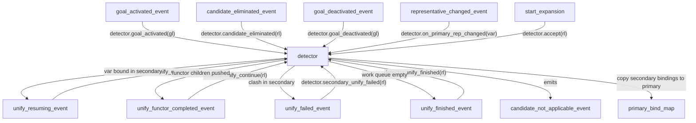
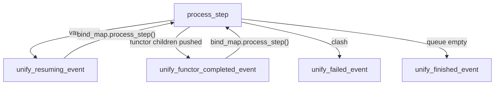

# Candidate Not Applicable Detector (JIT Unification) Plan

> **Implementation scope:** Do the big structural pieces only — updated `bind_map`, new events, new store, new entity. Do not do event handlers or `goal_expr_expander` wiring now.

## Core idea

Each active (goal, candidate) pair gets a dedicated secondary bind_map, keyed by `const resolution_lineage`*. When the pair is registered, the secondary is seeded by unifying `goal_expr` against a freshly-renamed copy of `rule_head` (the renaming produces the translation map, stored in `resolution_translation_map_store`). Thereafter, every time the primary map binds a variable, `candidate_not_applicable_detector` propagates that change into every affected secondary; if any secondary's unify fails it emits `unify_failed_event{rl}`, which an event handler routes to `detector.secondary_unify_failed(rl)`, which in turn emits `candidate_not_applicable_event{rl}`.

Secondary bind_maps are **plain `unordered_map`-based** — no `tracked<>`, no trail. There is nothing to roll back: bindings accumulate as the primary evolves, and are either accepted into the primary (via `accept(rl)`) or discarded when the candidate is eliminated. The primary `bind_map` also drops `tracked<>` since CDCL restarts from scratch on conflict rather than partially reverting.

## Key data flow




## New store: `resolution_translation_map_store`

Follows the existing `goal_*_store` pattern.

**Interface** `[core/hpp/domain/interfaces/i_resolution_translation_map_store.hpp](core/hpp/domain/interfaces/i_resolution_translation_map_store.hpp)`:

```cpp
using translation_map = std::unordered_map<uint32_t, uint32_t>;

struct i_resolution_translation_map_store {
    virtual ~i_resolution_translation_map_store() = default;
    virtual void insert(const resolution_lineage*, translation_map) = 0;
    virtual const translation_map& at(const resolution_lineage*) const = 0;
    virtual void erase(const resolution_lineage*) = 0;
};
```

**Implementation** `[core/hpp/infrastructure/resolution_translation_map_store.hpp](core/hpp/infrastructure/resolution_translation_map_store.hpp)` + `.cpp` — uses `tracked<std::unordered_map<const resolution_lineage*, translation_map>>` on the global trail (entries are created at `goal_activated` and erased at `goal_deactivated` / `candidate_eliminated`).

## bind_map changes

`bind_map` drops `tracked<>` entirely — bindings are never partially rolled back.

- `[core/hpp/infrastructure/bind_map.hpp](core/hpp/infrastructure/bind_map.hpp)`: `tracked<unordered_map<...>> bindings` → plain `unordered_map<uint32_t, const expr*> bindings`
- `[core/hpp/domain/interfaces/i_bind_map.hpp](core/hpp/domain/interfaces/i_bind_map.hpp)`: `unify()` return type `bool` → `void`; add `clear()`
- On unification failure the primary bind_map should `DEBUG_ASSERT(false)` — failures are caught by secondaries first; if the primary ever fails it is a bug
- A `bind_map_clearing_event_handler` (or reuse the existing sim store-clearing pattern) calls `bm.clear()` to reset bindings on sim restart

Secondary bind_maps owned by `candidate_not_applicable_detector` are plain `unordered_map`-based helper structs (not `bind_map` instances at all — see entity section below).

## Non-blocking unification protocol

Unification never runs to completion in a single call. Every meaningful step yields control to the scheduler via an event, allowing higher-priority events to fire before work resumes.

Each `bind_map` instance holds:

- `std::unordered_map<uint32_t, const expr*> bindings` — variable bindings (no `tracked<>`)
- `std::queue<std::pair<const expr*, const expr*>> work_queue` — pending unification pairs
- `const resolution_lineage* rl` — identity carried in emitted events (null for the primary `bind_map`)

Callers push pairs onto the queue and trigger `process_step()`. The `i_bind_map` interface gains `push(const expr*, const expr*)` and `process_step()` in place of the old synchronous `unify()`.




`process_step()` logic — runs exactly one meaningful step, then returns:

- Pop front `(lhs, rhs)`, WHNF both
- Same var → pop and loop immediately (trivial, no yield)
- One side is var → bind it, emit `unify_resuming_event{rl}` → return
- Both functors, names/arity match → push all `(arg_i, arg_j)` pairs, emit `unify_functor_completed_event{rl}` → return
- Mismatch → emit `unify_failed_event{rl}`, clear queue → return
- Queue now empty → emit `unify_finished_event{rl}` → return

## New events

`[candidate_deactivating_event](core/hpp/domain/events/candidate_deactivating_event.hpp)` carries `const resolution_lineage* rl`. It is emitted once per candidate when a goal is being torn down — completely distinct from `candidate_eliminated_event` (search-space narrowing). A fan-out handler converts `goal_deactivating_event{gl}` into one `candidate_deactivating_event{rl}` per candidate in `gcs.at(gl)`, so neither the detector nor the store need to remember a goal's candidate list at cleanup time.

The four unify events all carry `const resolution_lineage* rl`:

- `[unify_resuming_event](core/hpp/domain/events/unify_resuming_event.hpp)` — resume after a variable was bound
- `[unify_functor_completed_event](core/hpp/domain/events/unify_functor_completed_event.hpp)` — resume after a functor layer was matched and children were pushed
- `[unify_finished_event](core/hpp/domain/events/unify_finished_event.hpp)` — work queue drained; signals seeding of next candidate
- `[unify_failed_event](core/hpp/domain/events/unify_failed_event.hpp)` — unification clash detected

## New entity: `candidate_not_applicable_detector`

This **replaces** the old entity of the same name (see Deletions).

**Interface** `[core/hpp/domain/interfaces/i_candidate_not_applicable_detector.hpp](core/hpp/domain/interfaces/i_candidate_not_applicable_detector.hpp)`:

```cpp
struct i_candidate_not_applicable_detector {
    virtual ~i_candidate_not_applicable_detector() = default;
    virtual void goal_activated(const goal_lineage*) = 0;
    virtual void candidate_deactivating(const resolution_lineage*) = 0;  // cleanup — from goal teardown
    virtual void candidate_eliminated(const resolution_lineage*) = 0;    // search narrowing
    virtual void on_primary_rep_changed(uint32_t var_index) = 0;
    virtual void unify_continue(const resolution_lineage*) = 0;  // handles both resuming and functor_completed
    virtual void unify_finished(const resolution_lineage*) = 0;
    virtual void secondary_unify_failed(const resolution_lineage*) = 0;
    virtual void accept(const resolution_lineage*) = 0;
};
```

**Entity** `[core/hpp/domain/entities/candidate_not_applicable_detector.hpp](core/hpp/domain/entities/candidate_not_applicable_detector.hpp)`:

Secondary maps are plain internal structs (no trail, no `tracked<>`):

```cpp
struct secondary_map {
    std::unordered_map<uint32_t, const expr*> bindings;
    std::queue<std::pair<const expr*, const expr*>> work_queue;
    const expr* whnf(const expr*);
    // process_step: caller responsible for emitting the appropriate event based on result
    enum class step_result { resuming, functor_done, failed, finished };
    step_result process_step();
};
```

Storage:

- `std::unordered_map<const resolution_lineage*, secondary_map> secondaries`
- `std::unordered_map<uint32_t, std::unordered_set<const resolution_lineage*>> var_to_rls` — bimap forward
- `std::unordered_map<const resolution_lineage*, std::unordered_set<uint32_t>> rl_to_vars` — bimap reverse
- `std::unordered_map<const goal_lineage*, std::queue<size_t>> pending_candidates` — per-goal queue of candidate indices not yet seeded; drives the sequential seeding protocol
- No `goal → [rl*]` reverse map needed: `candidate_deactivating_event` delivers each `rl` individually at cleanup time

Resolves: `i_bind_map`, `i_goal_expr_store`, `i_goal_candidates_store`, `i_lineage_pool`, `i_database`, `i_copier`, `i_expr_pool`, `i_resolution_translation_map_store`, `i_event_producer<candidate_not_applicable_event>`, `i_event_producer<unify_resuming_event>`, `i_event_producer<unify_functor_completed_event>`, `i_event_producer<unify_finished_event>`, `i_event_producer<unify_failed_event>`

### `goal_activated(gl)`

1. Get all candidate indices from `gcs.at(gl).candidates`, push into `pending_candidates[gl]`
2. Pop first candidate and start seeding it: create `secondaries[rl]`, build and store translation map, push `(goal_expr, renamed_head)` onto secondary's `work_queue`
3. Call `unify_continue(rl)` internally (starts the cooperative processing loop)

### `unify_continue(rl)`

Calls `secondaries[rl].process_step()`, then emits the corresponding event:

- `resuming` → `unify_resuming_producer.produce({rl})`
- `functor_done` → `unify_functor_completed_producer.produce({rl})`
- `failed` → `unify_failed_producer.produce({rl})`
- `finished` → `unify_finished_producer.produce({rl})`

### `unify_finished(rl)`

1. Registers bimap entries for all goal-expression variables found during seeding
2. Reconciles with any already-bound primary vars: pushes `(var_expr, primary.whnf(var_expr))` pairs onto work_queue and calls `unify_continue(rl)` if needed
3. Pops next candidate index from `pending_candidates[rl->parent]`; if any remain, seeds that candidate (same as steps in `goal_activated`); if none remain, done

### `on_primary_rep_changed(var_index)`

For each `rl` in `var_to_rls[var_index]`:

- Push `(ep.make_var(var_index), primary.whnf(ep.make_var(var_index)))` onto `secondaries[rl].work_queue`
- Emit `unify_resuming_event{rl}` to start/continue processing

### `secondary_unify_failed(rl)`

Emits `candidate_not_applicable_event{rl}`.

### `accept(rl)`

Synchronous (the set of primary vars is small and bounded): for each `v` in `rl_to_vars[rl]`, call `primary.unify(ep.make_var(v), secondaries[rl].whnf(ep.make_var(v)))` — the primary's `unify` emits `representative_changed_event` internally for each new binding. The caller reads `rtms.at(rl)` for the translation map.

## Modified `goal_expr_expander` `[core/cpp/domain/entities/goal_expr_expander.cpp](core/cpp/domain/entities/goal_expr_expander.cpp)`

`start_expansion(rl)` changes:

- **Remove**: `bm.unify(goal_expr, r.head, rep_changes)` + event emission loop + `DEBUG_ASSERT(success)`
- **Add**: `detector.accept(rl)` — transfers secondary bindings to primary (primary emits `representative_changed_event` internally for each new binding)
- **Add**: `translation_map = rtms.at(rl)` — retrieve pre-built translation map for `expand_child`
- Still sets `rule_body = db.at(rl->idx).body`
- Resolves `i_candidate_not_applicable_detector` and `i_resolution_translation_map_store`; no longer needs `i_bind_map` or `i_event_producer<representative_changed_event>` directly

## 10 new event handlers (application/event_handlers)

Fan-out handler (converts goal-level event to per-candidate events):

- `candidate_deactivating_goal_deactivating_event_handler` — `goal_deactivating_event{gl}` → for each `idx` in `gcs.at(gl).candidates`: emit `candidate_deactivating_event{lp.get(gl, idx)}`

Store cleanup:

- `resolution_translation_map_store_candidate_deactivating_event_handler` — `candidate_deactivating_event` → `rtms.erase(e.rl)`

Detector handlers:

- `candidate_not_applicable_detector_goal_activated_event_handler` — `goal_activated_event` → `detector.goal_activated(e.gl)`
- `candidate_not_applicable_detector_candidate_deactivating_event_handler` — `candidate_deactivating_event` → `detector.candidate_deactivating(e.rl)`
- `candidate_not_applicable_detector_candidate_eliminated_event_handler` — `candidate_eliminated_event` → `detector.candidate_eliminated(e.rl)`
- `candidate_not_applicable_detector_representative_changed_event_handler` — `representative_changed_event` → `detector.on_primary_rep_changed(e.var_index)`
- `candidate_not_applicable_detector_unify_resuming_event_handler` — `unify_resuming_event` → `detector.unify_continue(e.rl)`
- `candidate_not_applicable_detector_unify_functor_completed_event_handler` — `unify_functor_completed_event` → `detector.unify_continue(e.rl)`
- `candidate_not_applicable_detector_unify_finished_event_handler` — `unify_finished_event` → `detector.unify_finished(e.rl)`
- `candidate_not_applicable_detector_unify_failed_event_handler` — `unify_failed_event` → `detector.secondary_unify_failed(e.rl)`

## Deletions

- Old `candidate_not_applicable_detector` (hpp + cpp) — replaced entirely by new implementation above
- Old `i_candidate_not_applicable_detector` — replaced by new interface above
- `goal_expr_changed_detector` (hpp + cpp) and `i_goal_expr_changed_detector`
- `goal_expr_changed_event` (hpp + cpp)
- Remove `goal_expr_changed_event` row from `[docs/priority.md](docs/priority.md)`

## Priority ordering for new events (relative, to add to `priority.md`)

All new events sit below `representative_changed_event` (prio 17):

- `unify_failed_event` — just below `representative_changed_event`; failure must be detected promptly
- `unify_functor_completed_event` — below `unify_failed_event`; no binding occurred, just structural progress
- `unify_resuming_event` — same tier as `unify_functor_completed_event` (both simply continue the cooperative loop)
- `unify_finished_event` — lowest of the four; only fires when work is truly done, safe to defer

