# ridge_dbuct: Delayed-Backtracking CHC Solver

## Goal & guardrails

Build `ridge_dbuct` (ridge delayed backtracking): a solver that keeps DBUCT's search state and solver state "camped" deep in the tree, backtracking lazily instead of restarting at the initial goals after every sim.

Hard rule: **do not touch existing infrastructure or manifests.** Every component whose behavior changes gets copied to a `dbuct_*` name. Originals (`solver`, `mcts_sim`, `run_sim`, `set_up_sim`, `tear_down_sim`, `ridge_manifest`, and the state structs) stay byte-for-byte as they are and keep passing their current tests.

The one sanctioned exception is Phase 0 below: `mcts_sim.hpp` must be repaired because the mcts submodule made a breaking change. That repair is behavior-preserving and is a hard prerequisite for everything else.

Confirmed decisions: scope = plan + core `dbuct_*` infra + test scenarios; reward = `-decision_count` over the FULL active path (so `decision_memory` must span the whole camped path, keeping UCB stats globally comparable per DBUCT's contract).

## Phase 0: unbreak the build (prerequisite, do first)

The mcts submodule (pinned at `6a7813c`, "split map_table into two files") removed `monte_carlo::map_table`, replacing it with `monte_carlo::visits_table<NodeHandle, Map>` and `monte_carlo::value_table<NodeHandle, IFloat, Map>`. `sim.hpp`'s public API is unchanged — it still takes four separate stat refs (IGetVisits, IGetValue, ISetVisits, ISetValue). The only core file that references the removed type is [mcts_sim.hpp](core/hpp/infrastructure/mcts_sim.hpp), so all three manifests (ridge/genius/horizon) currently fail to compile.

Fix (localized to `mcts_sim.hpp`, behavior-preserving):
- Replace `using table_t = monte_carlo::map_table<mcts_node_id, double, std::map>;` with two aliases: `using visits_table_t = monte_carlo::visits_table<mcts_node_id, std::map>;` and `using value_table_t = monte_carlo::value_table<mcts_node_id, double, std::map>;`.
- In the `mc_sim_t` alias, pass `visits_table_t` for the IGetVisits + ISetVisits slots and `value_table_t` for the IGetValue + ISetValue slots.
- Replace the single `table_t table_;` member with `visits_table_t visits_table_;` and `value_table_t value_table_;`.
- Update `set_up()`'s `mc_sim_.emplace(...)` to pass `visits_table_, value_table_, visits_table_, value_table_` for the four stat slots. Semantics are identical to today's `map_table` (which combined both interfaces on one object).

Then: `make core_debug_fast` and run `./build/core_debug_fast` to confirm the existing ridge/genius/horizon manifests and their tests are green BEFORE writing any `dbuct_*` code. Only proceed once the baseline is green.

## Terminology (used precisely throughout)

- **Choice**: the atomic thing MCTS/DBUCT emits from a single `choose()` call — either "pick this goal" or "pick this rule". DBUCT pushes one internal tree-policy frame per choice, and `terminate()` returns a backstep count measured in choices. In `ridge_dbuct`, **each choice gets its own trail frame** in the manifest.
- **Decision**: a bundle of choices that produces one resolution — descend to a goal (one or more goal choices) then pick a rule to resolve it against (one rule choice). One decision therefore spans multiple choice frames; the solver-state mutation (`resolver.resolve`) lands in the final (rule-choice) frame, while the goal-choice frames are pure navigation and log nothing.

## Current model vs. target model

Today ([solver.hpp](core/hpp/infrastructure/solver.hpp), [mcts_sim.hpp](core/hpp/infrastructure/mcts_sim.hpp)): each iteration reconstructs `monte_carlo::sim` on the root, `run_sim.run()` re-activates the initial goals + all candidates, and [tear_down_sim.hpp](core/hpp/infrastructure/tear_down_sim.hpp) wipes essentially all state wholesale then pops one trail frame. Only [elimination_backlog](core/hpp/infrastructure/elimination_backlog.hpp) is genuinely trail-backtrackable.

Target: one `monte_carlo::dbuct` built once on the root. The root frontier (initial goals + all candidates) is materialized once. Each episode descends from the current resume node; `dbuct::terminate(reward)` returns a `size_t` backstep count (in choices); the solver pops exactly that many choice frames off the trail to resurface at the resume node, then iteratively re-applies learned avoidances to each level it surfaces through — a fixpoint that can cascade into further backjumps as eliminations empty goals at successively shallower frames.

```mermaid
flowchart TD
    subgraph restart [Restart model - existing ridge]
        R0[set up: fresh sim on root + push 1 frame] --> R1[run_sim: re-activate initial goals + candidates]
        R1 --> R2[loop resolutions from root]
        R2 --> R3[tear down: sim.terminate void + wholesale clear + pop 1 frame]
        R3 --> R0
    end
    subgraph camp [Camping model - ridge_dbuct]
        C0[one-time: push root frame + activate initial goals and candidates + build dbuct] --> C1[episode: descend from resume node]
        C1 --> C2[per mcts choice: push choice frame; resolve mutations land in the rule-choice frame]
        C2 --> C3[reward = full path decision count]
        C3 --> C4["steps = dbuct.terminate(reward), in choices"]
        C4 --> C5[pop rollout frame always; then pop exactly steps choice frames]
        C5 --> C6[re-apply avoidances to CURRENT frontier - fixpoint per level]
        C6 --> C7{active goal emptied at this level?}
        C7 -->|yes| C8[learn new avoidance + pop more choice frames]
        C7 -->|no, candidates survive| C1
        C8 --> C6
    end
```

## The crux: per-choice backtrackable state

DBUCT's partial unwind is only sound if popping K choice frames yields exactly the solver state that existed at the resume node. Today that is false for every structure except the elimination backlog. So the core engineering task is to route per-choice mutations through the `trail` (using the existing [backtrackable_* wrappers](core/hpp/infrastructure/backtrackable_mutation.hpp) + [tracked.hpp](core/hpp/infrastructure/tracked.hpp), the same pattern `elimination_backlog` already uses) in new `dbuct_*` copies of the state structs, instead of clearing them wholesale. In practice the mutating work for a decision (elimination + `resolve`) is logged into that decision's rule-choice frame; goal-choice frames stay empty.

State that must become frame-scoped/backtrackable (new `dbuct_*` copies that `log` to the trail rather than mutate directly):
- `dbuct_goal_candidate_rules` (the active candidate set per goal — the thing conflict/unit detection reads)
- `dbuct_srt_active_goals` (the active-goal frontier)
- `dbuct_goal_exprs`
- `dbuct_candidate_frame_offsets`
- `dbuct_chosen_goal_candidates` (CDCL's `scan` reads this; it must reflect the camped path, not a single sim)
- `dbuct_decision_memory` (must span the full root-to-terminal path for the reward + lemma; backtracks with frames)
- `dbuct_unit_goals`
- `dbuct_frame_bump_allocator` (offset high-water mark must roll back)
- `bind_map`: hardest — `bind()` is loggable, but `whnf()` path-compression is a read-triggered write with no undo today. Plan: add a backtrackable `dbuct_bind_map` whose `whnf` compression is either logged or disabled while camping (decide during impl; flagged as top risk).
- `lineage_pool`: interning is monotonic + trimmed only at full teardown. Under camping, lineages reachable only from popped frames may be trimmed, but those still referenced by the surviving ancestor frontier or by persistent CDCL avoidances must survive. Needs a camping-aware pin/trim contract.

`cdcl` avoidances already persist across sims and are intentionally NOT trail-backtracked — that is exactly what we want (learning survives backtracking). `cdcl.cleanup()` (watcher reset) semantics need revisiting for the camped model.

## Component inventory (all new `dbuct_*`, originals untouched)

- `dbuct_sim` (copy of [mcts_sim.hpp](core/hpp/infrastructure/mcts_sim.hpp)): wraps `monte_carlo::dbuct` (from `mcts/include/dbuct.hpp`) instead of `monte_carlo::sim`. Built once on the root; `set_up()` no longer re-`emplace`s. Needs `visits_table` + `value_table` + `dispatches_table` + `linear_batch_increment` (note: the mcts submodule split `map_table` into `visits_table`/`value_table`, so the existing `monte_carlo::map_table` alias in `mcts_sim.hpp` cannot be reused as-is). `terminate(reward)` returns `size_t`; expose `in_rollout()` and the resume node so the caller can synchronize.
- `dbuct_solver` (copy of [solver.hpp](core/hpp/infrastructure/solver.hpp)): the camping loop in the mermaid above — one-time root setup, episode loop, `terminate`->pop, learn + re-apply + backjump, termination handling.
- `dbuct_set_up_sim` (copy of [set_up_sim.hpp](core/hpp/infrastructure/set_up_sim.hpp)): one-time root init (push root frame + activate initial goals & candidates once). Not called per episode.
- `dbuct_run_sim` (copy of [run_sim.hpp](core/hpp/infrastructure/run_sim.hpp)): runs one episode from the resume node; does NOT re-activate initial goals; opens a trail frame per mcts choice and lets `resolver` mutations land in the current rule-choice frame; opens a single transient rollout frame when `in_rollout()` flips.
- `dbuct_decision_generator` (copy of [mcts_decision_generator.hpp](core/hpp/infrastructure/mcts_decision_generator.hpp)): same two-phase decision (goal choice(s) then rule choice), but coordinates frame pushes so the trail choice-frame count == dbuct's internal tree-policy frame count (one frame per choice).
- `dbuct_backtracker` (new): pops the transient rollout frame unconditionally, then pops exactly `steps` choice frames.
- `dbuct_learn_reapply` (new): an **iterative fixpoint**, not a single pass. After each backtrack, it re-runs constraint propagation (learned CDCL avoidances via `elimination_router` + two-watched-literal `constrain`) against the *currently* resurfaced frontier. If that empties an active goal, it learns a new avoidance and backjumps another level — and then re-applies **again** at that shallower frame, because the accumulated avoidances (old + newly learned) can fire fresh eliminations at each level unwound (parent, then grandparent, ...). The loop stops when a level is reached whose active goals all still have candidates, a solution is found, or the root is reached with the space refuted.
- `dbuct_manifest` (copy of [ridge_manifest.hpp](core/hpp/infrastructure/ridge_manifest.hpp) + [.cpp](core/cpp/infrastructure/ridge_manifest.cpp)): wires all of the above. Reward stays `ridge_reward = -decision_count` (unchanged) because `dbuct_decision_memory` now spans the full path.

## Frame synchronization contract

Invariants the design must hold (these drive the tests):
- One trail choice frame is pushed per DBUCT tree-policy choice; none during rollout. Therefore `#choice frames pushed this episode == #internal dbuct frames`, and popping `terminate()`'s return value (a count of choices) lands exactly on the resume node.
- Goal-choice frames log no state mutation (pure navigation); the rule-choice frame absorbs the subsequent elimination + `resolve()` mutations for that decision.
- Rollout-phase mutations are ALWAYS fully undone at episode end (rollout is throwaway), independent of the backstep count.

## Reward & termination under camping

- Reward = `-decision_count` over the full active path via `dbuct_decision_memory`, passed to `dbuct::terminate(reward)`.
- `solved`: surfaced immediately when `solution_detector` fires, regardless of camp depth; solver stops.
- Refutation: detected when backtracking reaches the root and the root path has zero decisions / an emptied initial goal / CDCL learned an empty avoidance — must terminate, not loop forever camped.
- `depth_exceeded`: define whether `max_resolutions` counts from root or from the resume node (default: from root, i.e. total active-path depth) — flagged as a small open decision.

## Scenarios to cover (behavioral contracts)

These are contracts, not implementation snapshots. Each should survive rewriting internals as long as the public obligation holds. Where mocks are involved, apply the specificity rule: exact `Times(n)` only for genuine side effects (frame pushes/pops, eliminations, mutations); `AtLeast(1)`/`ON_CALL` for reads (candidate-set queries, active-goal checks, chosen-candidate lookups).

1. Camp / no unwind: an episode that DBUCT grants budget to returns `terminate()==0`; trail depth and the active frontier are unchanged; the next episode continues deeper from the same resume node.
2. Partial backtrack round-trip: `terminate()==k>0` pops exactly k choice frames and the resulting frontier + candidate sets + bindings + frame offsets are identical to the state that existed at the resume node.
3. Full backtrack == restart-equivalence: when `terminate()` returns the whole path length, the resurfaced state equals the freshly-initialized root frontier (initial goals + all candidates minus globally-learned eliminations) — sanity-checks against the existing ridge behavior.
4. Choice-frame granularity: one decision = N goal choices (to descend) + 1 rule choice, pushing N+1 synchronizable choice frames; backtracking unwinds the goal-choice frames as no-ops and the rule-choice frame as real state.
5. Rollout is throwaway: mutations made during `in_rollout()` are fully undone at episode end regardless of backstep count; only tree-policy choice frames persist.
6. Deep learning applied to ancestor: an episode that conflicts deep and learns a unit avoidance eliminates that candidate from an ANCESTOR goal's active set after backtracking (the set that was populated before the learning).
7. Cascading backjump — eliminations fire at multiple successive levels: applying a learned avoidance empties an active goal at the parent frame -> learn + backjump to the grandparent -> re-application at the grandparent fires ANOTHER elimination (from the accumulated avoidances) that also empties a goal there. Verify the re-apply runs as a fixpoint at each unwound level (parent, then grandparent, ...), not once, and that the solver lands only on a level where every active goal still has candidates (or refutes at root).
8. Two-watched-literal propagation across the camped frontier: a learned size>=2 avoidance stays dormant, then forces an elimination once ancestor-path choices fix its watched goals — without any restart-from-root.
9. Elimination backlog respects frame boundaries: backlog inserts for popped frames roll back; inserts for surviving ancestor frames remain and still suppress re-creation of those candidates when the goal is re-activated deeper.
10. Idempotent global elimination: once a candidate is globally eliminated and applied to an ancestor, it never reappears as an `mcts_choice` in later episodes descending through that ancestor.
11. Binding/offset consistency after partial backtrack: bindings and bumped frame offsets created deeper are rolled back so the resume node's unification/allocation state is exactly as before (explicitly exercises the `whnf` compression + MHU `common_.bind` read-write hazard).
12. Lineage pool safety under camping: no lineage still referenced by the surviving ancestor frontier or by a persistent CDCL avoidance is trimmed after a partial backtrack; lineages reachable only from popped frames may be reclaimed (no dangling pointers).
13. Solution while camped: reaching a solution deep surfaces `solved` and stops the solver even though DBUCT never returned to root.
14. Refutation terminates: an unsolvable problem drives backtracking all the way to root and terminates with refutation rather than looping camped forever.
15. DBUCT completeness / gradual backtracking: over many episodes the resume depth oscillates and the root visit count grows (budget exhaustion forces eventual re-exploration from higher up), matching DBUCT's completeness guarantee; with batch-increment `B = SIZE_MAX` the run degenerates to vanilla-UCT restart behavior (equivalence check).

## Testing approach

Per [docs/testing.md](docs/testing.md): unit tests mock every collaborator via `i_*` interfaces (one real SUT), integration tests wire real slices. Concretely:
- Unit tests for the small new pieces (`dbuct_backtracker`, `dbuct_learn_reapply`, `dbuct_decision_generator`) with GMock collaborators, asserting delegation contracts.
- Integration test `core/test/integration/dbuct_manifest.cpp` (mirroring [ridge_manifest.cpp](core/test/integration/ridge_manifest.cpp)) driving real slices to assert the cross-component invariants in scenarios 1-15 (frame round-trips, ancestor re-application, backjump, solved/refuted termination).
- Behavior-focused assertions: verify resurfaced state via public queries (candidate-set contents, active-goal membership, trail depth, decision count, termination enum), not internal call orders.

## Key risks / open sub-decisions

- `bind_map::whnf` path compression has no undo today — the single biggest correctness hazard for partial backtrack (scenario 11). Needs an explicit strategy (log compression, or suppress it while camping).
- mcts submodule `map_table` split into `visits_table`/`value_table` breaks the current build; fixed up front in Phase 0 for `mcts_sim.hpp`. `dbuct_sim` additionally needs `dispatches_table` + `linear_batch_increment`.
- `cdcl.cleanup()` watcher-reset semantics under a persistent (non-restarting) frontier.
- `max_resolutions`/`depth_exceeded` counting origin (root vs resume node).