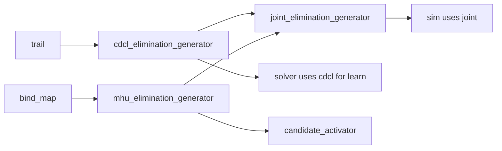

# Bootstrap and Wiring

## Composition model

The solver stack is wired by **explicit construction and manual dependency injection** — no service locator, no runtime `type_index` registry.

A **manifest** (or **session** / **context** type) is the single place that:

1. Owns the **lifetime** of all long-lived objects (storage, trail, generators, `sim`, `solver`).
2. Constructs them in **dependency order** with `std::make_unique` / members / a struct of references.
3. Passes **interface references** into constructors (`i_trail&`, `i_run_sim&`, …) exactly as tests do today.
4. Exposes only what the entry layer needs (e.g. `i_solve&`, or `solver&`).

Different manifests (or manifest factories) select variants — e.g. random vs MCTS decision generator, debug vs fast — without changing `sim` or `solver` implementations.

## First manifest: `random` + `joint`

The first full production manifest wires:

| Registered for `sim` / `solver` | Concrete type | Notes |
|----------------------------------|---------------|--------|
| `i_generate_decision` | **`random_decision_generator`** | Needs `std::mt19937` owned by session |
| `i_elimination_generator` (sim) | **`joint_elimination_generator`** | Facade only — must reference existing CDCL + MHU |
| `i_learn_avoidance` (solver) | **`cdcl_elimination_generator`** | Same CDCL object as joint’s first arm, **not** the joint |
| `i_try_add_mhu_head` / `i_clear_mhu_heads` | **`mhu_elimination_generator`** | Same MHU object as joint’s second arm |

See [mhu.md](mhu.md) for semantics of unify heads, the common bind map, and rebase-driven elimination.

**`joint_elimination_generator` does not replace CDCL or MHU.** The manifest must construct and own all three; `joint` only holds references:

```cpp
auto cdcl = std::make_unique<cdcl_elimination_generator>(trail);
auto mhu  = std::make_unique<mhu_elimination_generator>(
    bind_map, lineage_pool, expr_pool, bind_map_factory,
    overlay_bind_map_factory, unifier_factory, goal_candidate_rules);
auto joint = std::make_unique<joint_elimination_generator>(*cdcl, *mhu);
```

Construction order for the elimination slice (after `trail`, `bind_map`, factories, `lineage_pool`, `goal_candidate_rules`, `expr_pool`):



`random_decision_generator` is built **after** `active_goals`, `goal_candidate_rules`, and `lineage_pool` (it iterates goals and reads candidate rules).

Factory entry point name (proposed):

```cpp
std::unique_ptr<i_solver_session> make_random_joint_session(solver_session_config cfg);
```

MCTS and other decision generators stay separate manifests later; they still reuse the same CDCL/MHU/joint triple if elimination policy unchanged.

## Suggested layout

```
core/hpp/infrastructure/basic_manifest.hpp   # first manifest: owns storage + wires sim + solver
core/cpp/infrastructure/basic_manifest.cpp
```

Optional later split if manifests diverge:

```
core/hpp/infrastructure/mcts_manifest.hpp   # later, same pattern as basic_manifest
```

Each manifest implements the same narrow interface:

```cpp
struct i_solver_session {
    virtual ~i_solver_session() = default;
    virtual i_solve& solve() = 0;
    virtual const db& database() const = 0;
};
```

## `solver_session` responsibilities

### Phase 1 — Storage (no sim/solver yet)

Construct in order (each step only needs earlier steps):

| Step | Objects | Notes |
|------|---------|--------|
| 1 | `trail` | Root undo log |
| 2 | `expr_pool`, `var_sequencer`, `bind_map`, factories | `bind_map` is common map |
| 3 | `db` (filled by parser **before** session, or passed in) | Rules + goals source |
| 4 | `lineage_pool`, `goal_exprs`, `active_goals`, `goal_candidate_rules`, `unit_goals`, `elimination_backlog`, `deactivated_candidate_memory`, `decision_memory`, `resolution_memory` | Mostly trail-backed or explicit clear |
| 5 | `cdcl_elimination_generator`, `mhu_elimination_generator`, `joint_elimination_generator` | **Same** `cdcl` / `mhu` instances everywhere below |
| 6 | `copier`, detectors, `get_resolution_rule`, activators/deactivators, `get_unit_resolution`, `resolver`, `elimination_router` | Resolver is the largest subgraph |
| 7 | Decision generator | `random_decision_generator` or `mcts_decision_generator` (+ external MCTS tree) |

Hold each as `std::unique_ptr<Concrete>` (or members) so addresses are stable for the session lifetime.

### Phase 2 — Orchestration

```cpp
sim simulation{
    config.max_resolutions,
    trail, trail,                    // push / pop (same object)
    initial_goal_exprs,
    initial_goal_activator,
    lineage_pool,
    db,
    lineage_pool,                    // make_resolution_lineage
    candidate_activator,
    solution_detector,
    conflict_detector,
    unit_goal_detector,
    unit_goals, unit_goals,
    *decision_generator,
    joint,                           // i_elimination_generator
    elimination_router,
    resolver,
    get_unit_resolution,
    decision_memory, decision_memory,  // record + clear
    resolution_memory, resolution_memory,
    deactivated_candidate_memory,
    goal_candidate_rules, goal_exprs, active_goals,
    candidate_translation_maps,
    mhu,                             // clear_mhu_heads
    bind_map,
    lineage_pool};                    // trim

solver solver_engine{
    simulation, simulation, simulation,  // set_up / tear_down / run
    decision_memory, decision_memory,
    lineage_pool,
    cdcl,                                // learn_avoidance (not joint)
    elimination_router};
```

### Phase 3 — Entry

CLI / tests:

```cpp
db database = import_from_file(path);
solver_session session{solver_session_config{.db = &database, ...}};
auto sm = session.solve().solve();
```

## Shared-instance checklist

When wiring, these **must** be the same object:

| Interface role | Single instance |
|----------------|-----------------|
| `i_set_up_sim` / `i_run_sim` / `i_tear_down_sim` | `sim` |
| `i_learn_avoidance` | `cdcl_elimination_generator` (not `joint`) |
| `i_elimination_generator` (inside sim) | `joint_elimination_generator` |
| `i_try_add_mhu_head` (activator) + `i_clear_mhu_heads` | `mhu_elimination_generator` |
| `i_make_resolution_lineage` / pin / trim | `lineage_pool` |
| `i_record_decision` / count / derive lemma | `decision_memory` |
| `i_push_trail_frame` / `i_pop_trail_frame` / `i_log_to_current_trail_frame` | `trail` |

Document this list in the manifest `.cpp` with comments — it is the main footgun.

## Manifest variants (no locator)

Use **subclasses or named factory functions**, not a global registry:

```cpp
std::unique_ptr<i_solver_session> make_random_joint_session(solver_session_config cfg);
std::unique_ptr<i_solver_session> make_mcts_joint_session(solver_session_config cfg);  // later
```

Each factory returns the same `solver_session` type; the first manifest only swaps step 7 (`random_decision_generator` vs MCTS). CDCL/MHU/joint construction is shared.

## Testing strategy

| Layer | Test |
|-------|------|
| Manifest | Narrow integration: build session with real `db` fixture + run one `solve()` step |
| `sim` | Integration with real trail + joint + router (no mocks) |
| `solver` | Integration: real `sim` + real `cdcl` + memory |

Unit tests keep mocking interfaces; bootstrap tests prove **wiring** only.

## Parser boundary

Parser produces a populated **`db`** (and goal exprs). The manifest **does not** parse; it receives `const db&` or `db*` from CLI. That keeps `core` free of ANTLR and keeps construction deterministic.

## What we are not doing

- **Service locator** / `locator::resolve<T>()` in constructors
- **Implicit singletons** for solver services
- **Co_yield nullptr** as stream terminator — elimination coroutines end with **`co_return`**; consumers use `!resume().has_value()` / `done()`
