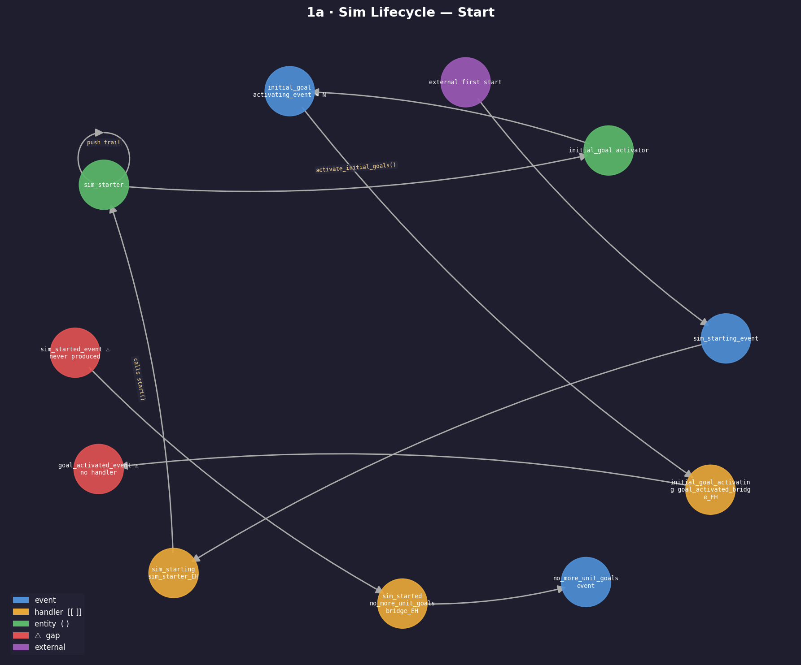
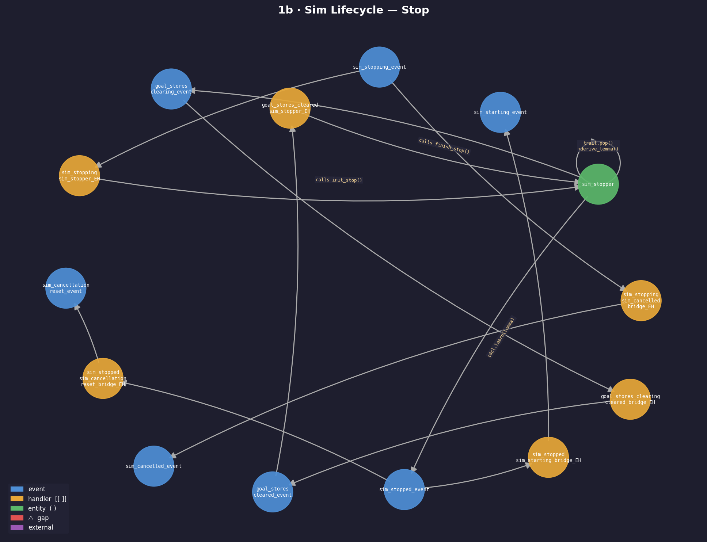
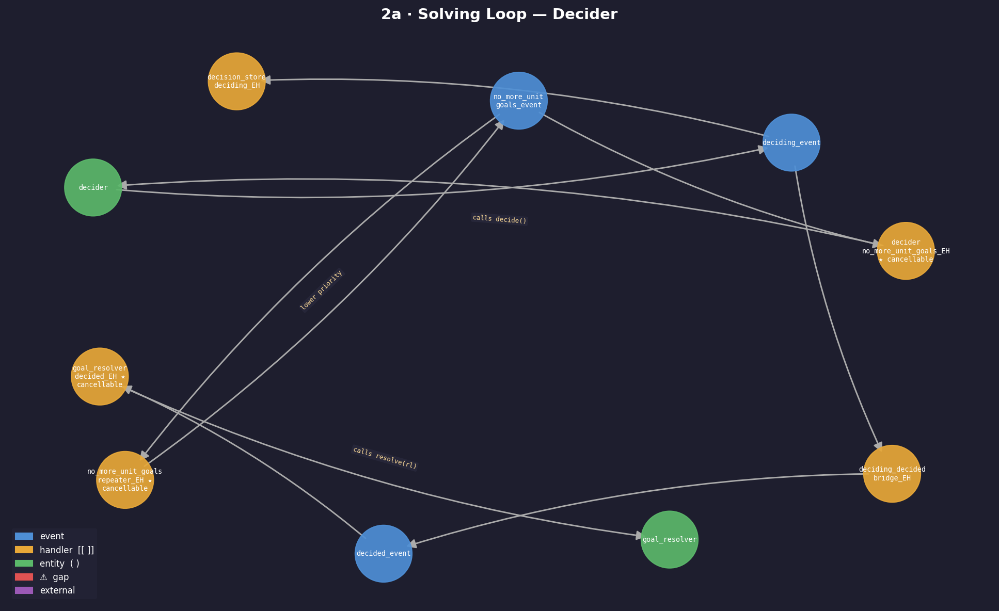
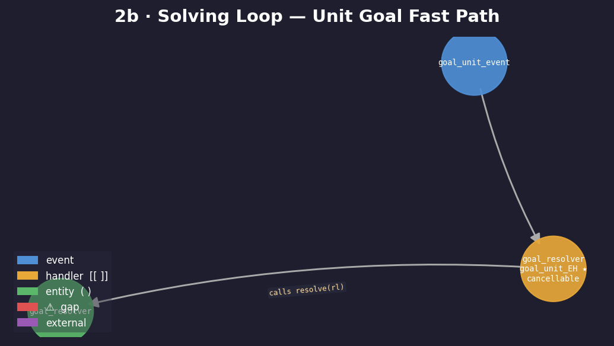
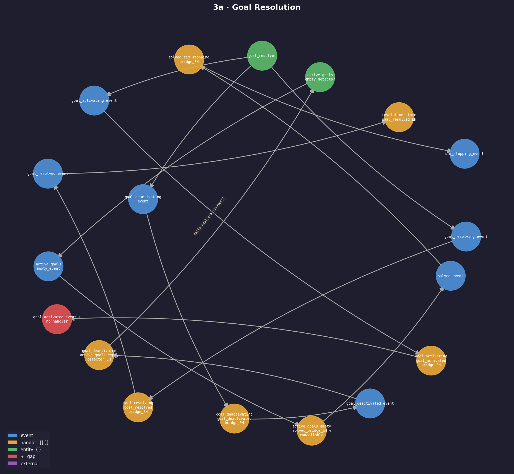
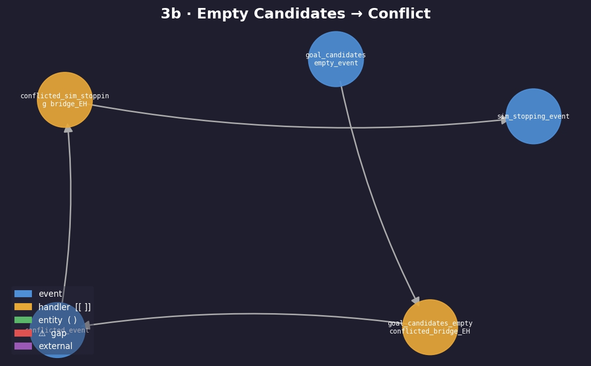
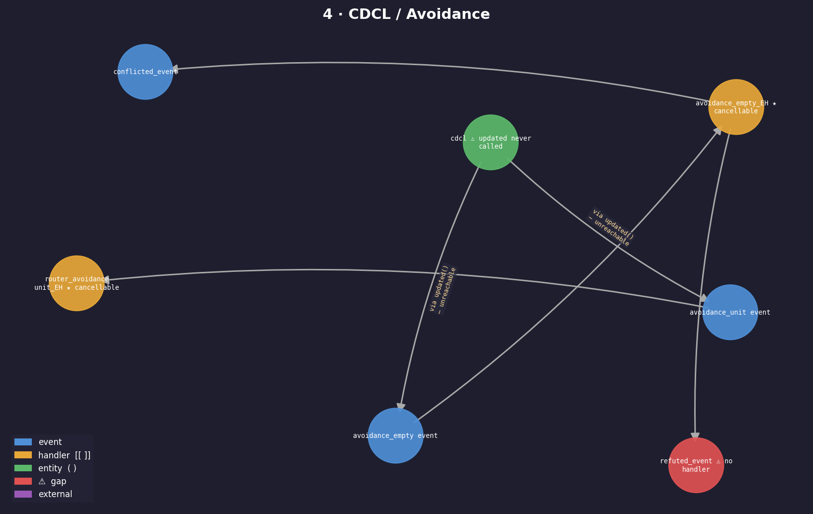
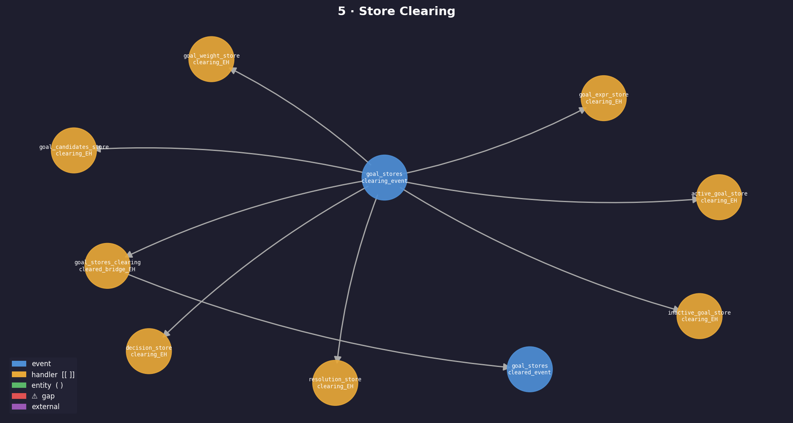
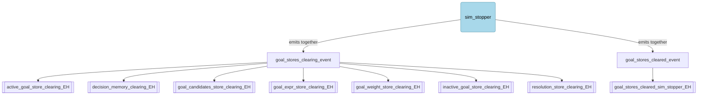

# Event Graph

This document maps every event, entity (as producer), and event handler in the core. It is derived directly from the headers and implementations.

**Node conventions used in the diagrams below:**
- `[event]` - event type
- `(entity)` - domain entity that produces events by calling its methods
- `[[handler]]` - event handler struct; `(C)` marks cancellable handlers
- `[!]` - a gap: either an event that is produced but never consumed, or consumed but never produced

---

## Architectural Principles

These rules govern the design of all events, handlers, and entities in this codebase.

### 1. Prefer direct method calls over `-ing` trigger events

When code needs to kick off a phase transition, call the entity method directly (`sim_stopper.init_stop()`, `sim_starter.complete_start()`) rather than emitting a `*_ing` event and relying on a handler to relay it. The `-ing` event pattern is only justified when the set of reactors is open-ended and user-extensible at runtime — the canonical example being goal activation, where an unknown number of stores each need to react independently. In that case, rename the event to sound like a **command** (`activate_goal_event`) rather than a notification, making the intent clear.

### 2. Emit sibling events together — never chain `-ing` to `-ed` via a bridge

Events that conceptually happen at the same moment (e.g. `goal_stores_clearing_event` and `goal_stores_cleared_event`) must be emitted together by the entity that owns the transition, not chained through a bridge handler. Bridges that exist solely to convert `*_ing` to `*_ed` add indirection without value and make the execution order harder to reason about. Priority ordering is the correct tool for sequencing reactions; bridges are not.

### 3. Entities own large phase transitions — application layer does minimal work

Domain entities (`sim_starter`, `sim_stopper`, `conflicted_detector`, `solved_detector`, ...) are responsible for all semantically meaningful decisions: declaring the sim started, declaring it solved, declaring a conflict. Application-layer event handlers should do one of two things only: call a single entity method, or emit a single event. Any handler that makes a conditional decision or encodes domain knowledge (e.g. "if sim_active then conflicted else refuted") is doing entity work and must be moved into an entity.

---

## 1. Sim Lifecycle

The lifecycle is a continuous loop. `sim_starter.start()` is called once externally to start the first run; thereafter it is called again by the restart handler when `sim_stopped_event` fires (unless cancelled by `refuted_event`).



```mermaid
flowchart TD
  external([external calls sim_starter.start()])
  ent_sim_starter(sim_starter)
  ent_initial_goal_activator(initial_goal_activator)
  e_initial_goal_activating[initial_goal_activating_event x N]
  e_goal_activated[goal_activated_event  [!] no handler]
  e_goals_activated[initial_goals_activated_event]
  h_goals_activated_starter[[sim_starter_initial_goals_activated_EH]]
  e_sim_started[sim_started_event]
  e_no_more_unit_goals[no_more_unit_goals_event]

  external -->|calls start()| ent_sim_starter
  ent_sim_starter -->|push trail| ent_sim_starter
  ent_sim_starter -->|activate_initial_goals()| ent_initial_goal_activator
  ent_initial_goal_activator -->|emits together| e_initial_goal_activating
  ent_initial_goal_activator -->|emits together| e_goal_activated
  ent_initial_goal_activator -->|lower priority| e_goals_activated
  e_goals_activated --> h_goals_activated_starter
  h_goals_activated_starter -->|calls complete_start()| ent_sim_starter
  ent_sim_starter -->|emits together| e_sim_started
  ent_sim_starter -->|emits together| e_no_more_unit_goals
  classDef entity fill:#a8d8ea,stroke:#4a90a4,color:#000,font-size:17px,padding:12px
  class external,ent_sim_starter,ent_initial_goal_activator entity
```



```mermaid
flowchart TD
  e_sim_stopping[sim_stopping_event]
  h_stopping_stopper[[sim_stopping_sim_stopper_EH]]
  ent_sim_stopper(sim_stopper)
  e_goal_stores_clearing[goal_stores_clearing_event]
  e_goal_stores_cleared[goal_stores_cleared_event]
  h_cleared_stopper[[goal_stores_cleared_sim_stopper_EH]]
  e_sim_stopped[sim_stopped_event  [!] restart policy TBD]
  e_sim_stopping --> h_stopping_stopper
  h_stopping_stopper -->|calls init_stop()| ent_sim_stopper
  ent_sim_stopper -->|trail.pop() + derive_lemma()| ent_sim_stopper
  ent_sim_stopper -->|emits together| e_goal_stores_clearing
  ent_sim_stopper -->|emits together| e_goal_stores_cleared
  e_goal_stores_cleared --> h_cleared_stopper
  h_cleared_stopper -->|calls finish_stop()| ent_sim_stopper
  ent_sim_stopper -->|cdcl.learn(lemma)| ent_sim_stopper
  ent_sim_stopper --> e_sim_stopped
  classDef entity fill:#a8d8ea,stroke:#4a90a4,color:#000,font-size:17px,padding:12px
  class ent_sim_stopper entity
```

---

## 2. Solving Loop

`no_more_unit_goals_event` is the heartbeat of the solver. It either causes a decision (via `decider`) or, at lower priority, re-emits itself so the loop continues after resolution events have settled.



```mermaid
flowchart TD
  e_no_more[no_more_unit_goals_event]
  h_decider[[decider_no_more_unit_goals_EH  (C)]]
  h_repeater[[no_more_unit_goals_repeater_EH  (C)]]
  ent_decider(decider)
  e_deciding[deciding_event]
  e_decided[decided_event]
  h_deciding_store[[decision_memory_deciding_EH]]
  h_resolver_decided[[resolver_decided_EH  (C)]]
  ent_resolver(resolver)

  e_no_more --> h_decider
  e_no_more --> h_repeater
  h_repeater -->|lower priority| e_no_more
  h_decider -->|calls decide()| ent_decider
  ent_decider -->|emits together| e_deciding
  ent_decider -->|emits together| e_decided
  e_deciding --> h_deciding_store
  e_decided --> h_resolver_decided
  h_resolver_decided -->|calls resolve(rl)| ent_resolver
  classDef entity fill:#a8d8ea,stroke:#4a90a4,color:#000,font-size:17px,padding:12px
  class ent_decider,ent_resolver entity
```

The unit-goal fast path bypasses the decider entirely:



```mermaid
flowchart TD
  e_goal_unit[goal_unit_event]
  h_resolver_unit[[resolver_goal_unit_EH  (C)]]
  ent_resolver(resolver)
  e_goal_unit --> h_resolver_unit
  h_resolver_unit -->|calls resolve(rl)| ent_resolver
  classDef entity fill:#a8d8ea,stroke:#4a90a4,color:#000,font-size:17px,padding:12px
  class ent_resolver entity
```

---

## 3. Goal Resolution

`resolver.resolve(rl)` deactivates the current goal and activates N subgoals for the body of the matched rule.



```mermaid
flowchart TD
  ent_resolver(resolver)

  e_goal_resolving[resolving_event]
  e_goal_resolved[resolved_event]
  h_res_store_resolved[[resolution_memory_resolved_EH]]

  e_goal_activating[goal_activating_event]
  e_goal_activated[goal_activated_event  [!] no handler]

  e_goal_deactivating[goal_deactivating_event]
  e_goal_deactivated[goal_deactivated_event]
  h_sdet_deactivated[[solved_detector_goal_deactivated_EH]]
  ent_sdet(solved_detector)
  e_solved[solved_event]
  h_solved_stopper[[sim_stopper_solved_EH]]
  ent_stopper(sim_stopper)

  ent_resolver -->|emits together| e_goal_resolving
  ent_resolver -->|emits together| e_goal_resolved
  ent_resolver -->|emits together| e_goal_activating
  ent_resolver -->|emits together| e_goal_activated
  ent_resolver -->|emits together| e_goal_deactivating
  ent_resolver -->|emits together| e_goal_deactivated

  e_goal_resolved --> h_res_store_resolved

  e_goal_deactivated --> h_sdet_deactivated
  h_sdet_deactivated -->|calls detect_solved()| ent_sdet
  ent_sdet --> e_solved
  e_solved --> h_solved_stopper
  h_solved_stopper -->|calls init_stop()| ent_stopper
  classDef entity fill:#a8d8ea,stroke:#4a90a4,color:#000,font-size:17px,padding:12px
  class ent_resolver,ent_sdet,ent_stopper entity
```

Empty candidates end the run with a conflict:



```mermaid
flowchart TD
  e_goal_candidates_empty[goal_candidates_empty_event]
  h_cdet_candidates[[conflicted_detector_goal_candidates_empty_EH]]
  ent_cdet(conflicted_detector)
  e_conflicted[conflicted_event]
  h_conflicted_stopper[[sim_stopper_conflicted_EH]]
  ent_stopper(sim_stopper)
  h_rdet[[refuted_detector_conflicted_EH]]
  ent_rdet(refuted_detector)
  e_refuted[refuted_event  [!] restart policy TBD]

  e_goal_candidates_empty --> h_cdet_candidates
  h_cdet_candidates -->|calls candidates_empty()| ent_cdet
  ent_cdet --> e_conflicted
  e_conflicted --> h_conflicted_stopper
  h_conflicted_stopper -->|calls init_stop()| ent_stopper
  e_conflicted --> h_rdet
  h_rdet -->|calls conflicted()| ent_rdet
  ent_rdet -->|if decisions empty| e_refuted
  classDef entity fill:#a8d8ea,stroke:#4a90a4,color:#000,font-size:17px,padding:12px
  class ent_cdet,ent_rdet entity
```

---

## 4. CDCL / Avoidance

CDCL emits `avoidance_unit_event` and `avoidance_empty_event` from its private `updated()` method. Handlers exist for both, but `updated()` is never called - see gaps below.



```mermaid
flowchart TD
  ent_cdcl(cdcl  [!] updated() never called)
  e_avoidance_unit[avoidance_unit_event]
  e_avoidance_empty[avoidance_empty_event]
  h_router[[router_avoidance_unit_EH  (C)]]
  h_cdet_avoidance[[conflicted_detector_avoidance_empty_EH  (C)]]
  ent_cdet(conflicted_detector)
  e_conflicted[conflicted_event]
  h_rdet[[refuted_detector_conflicted_EH]]
  ent_rdet(refuted_detector)
  e_refuted[refuted_event  [!] restart policy TBD]

  ent_cdcl -.->|via updated() - unreachable| e_avoidance_unit
  ent_cdcl -.->|via updated() - unreachable| e_avoidance_empty
  e_avoidance_unit --> h_router
  e_avoidance_empty --> h_cdet_avoidance
  h_cdet_avoidance -->|calls avoidance_empty()| ent_cdet
  ent_cdet --> e_conflicted
  e_conflicted --> h_rdet
  h_rdet -->|calls conflicted()| ent_rdet
  ent_rdet -->|if decisions empty| e_refuted
  classDef entity fill:#a8d8ea,stroke:#4a90a4,color:#000,font-size:17px,padding:12px
  class ent_cdcl,ent_cdet,ent_rdet entity
```

---

## 5. Store Clearing

Seven stores are cleared in parallel when `goal_stores_clearing_event` fires. `sim_stopper.init_stop()` emits both `goal_stores_clearing_event` and `goal_stores_cleared_event` together — no bridge needed.





---

## 6. Gaps and Dead Ends

These require attention before the solver can work end-to-end.

### Events consumed but never produced

None currently identified.
### Events produced but never consumed

These events are emitted into the topic but no handler is subscribed to them. The wiring between entity method calls and event consumption is missing.

| Event | Producer | Missing handler / wiring |
|-------|----------|--------------------------|
| `goal_activated_event` | `goal_activating_*_bridge` handlers | Should trigger initializers (`goal_expr`, `goal_candidates`, `goal_weight`) and `goal_expr_changed_detector.goal_activated()`, `elimination_backlog.goal_activated()` |
| `goal_candidates_changed_event` | `goal_candidates_expander` | Should trigger `goal_unit_detector.candidates_changed()` and `goal_candidates_empty_detector.candidates_changed()` |
| `representative_changed_event` | `goal_expr_expander` | Should trigger `goal_expr_changed_detector.rep_updated()` |
| `goal_expr_changed_event` | `goal_expr_changed_detector` | Should trigger `unify_synchronizer` |
| `unify_failed_event` (rl != nullptr) | secondary unifier | Triggers `active_eliminator.eliminate(rl)` via `active_eliminator_unify_failed_event_handler` |
| `candidate_eliminating_event` | `active_eliminator` | Triggers `unify_synchronizer.unregister_candidate(rl)` |
| `eliminate_candidate_yield_event` | `active_eliminator` | Triggers `active_eliminator.resume()` |
| `backlogged_elimination_freed_event` | `elimination_backlog` | Should trigger `active_eliminator.eliminate(rl)` for previously backlogged candidates |
| `candidate_eliminated_event` | `active_eliminator` | Possibly intentional observation; no downstream action defined |
| `refuted_event` | `avoidance_empty_event_handler` | Terminal - no handler. Distinct from `conflicted`. Needs resolution. |

### Entity methods never called

| Entity method | How it should be triggered |
|--------------|---------------------------|
| `cdcl::updated()` | Private - never invoked internally; `avoidance_unit_event` and `avoidance_empty_event` are therefore unreachable |
| `sim_activity_monitor::set_sim_active()` | Not called by any handler; `avoidance_empty_event_handler` checks `get_sim_active()` but the flag is always `false` |
| `goal_expr_expander::start_expansion()` / `expand_child()` | Not connected to any event |
| `goal_candidates_expander::start_expansion()` / `expand_child()` | Not connected to any event |

---

## 7. Pending Architecture Changes

These decisions were agreed during design review. They are not yet reflected in the diagrams or code above.

---

### 7.1  Remove all `-ing`→`-ed` bridges — entities emit both events together

Bridge handlers that exist solely to translate a `*_ing` event into the corresponding `*_ed` event give event handlers too much structural power and are hard to reason about (the whole downstream depends on the bridge being wired). Instead, the entity that owns the transition emits **both** events at the same moment.

Bridges to delete and their replacements:

| Bridge (to delete) | Replacement |
|--------------------|-------------|
| `goal_stores_clearing_cleared_bridge_EH` | `sim_stopper` emits `goal_stores_clearing_event` + `goal_stores_cleared_event` together |
| `deciding_decided_bridge_EH` | `decider` emits `deciding_event` + `decided_event` together |

---

### 7.2  `sim_stopper` owns its full cancellation lifecycle

`sim_stopper.init_stop()` should emit `sim_cancelled_event` directly — no bridge.
`sim_stopper.finish_stop()` should emit `sim_stopped_event` directly — no bridge. (`sim_cancellation_reset_event` has since been removed; `sim_started_event` serves as the reset signal instead.)

Bridges to delete:

| Bridge (to delete) | Replacement |
|--------------------|-------------|
| `sim_stopping_sim_cancelled_bridge_EH` | `sim_stopper.init_stop()` emits `sim_cancelled_event` |
| `sim_stopped_sim_cancellation_reset_bridge_EH` | `sim_stopper.finish_stop()` emits `sim_stopped_event` (reset via `sim_started_event`) |

---

### 7.3  `sim_starter` owns the full start lifecycle

`sim_starter.complete_start()` (new method) closes the startup sequence. It should emit `sim_started_event` **and** fire `no_more_unit_goals_event` directly to prime the solving loop — no bridge.

Bridges/handlers to delete:

| Bridge (to delete) | Replacement |
|--------------------|-------------|
| `sim_started_no_more_unit_goals_bridge_EH` | `sim_starter.complete_start()` emits `no_more_unit_goals_event` |

New handler to add:

| Handler | Listens to | Calls |
|---------|-----------|-------|
| `sim_starter_initial_goals_activated_EH` | `initial_goals_activated_event` | `sim_starter.complete_start()` |

---

### 7.4  Replace `goal_candidates_empty_conflicted_bridge` with `conflicted_detector` entity

The rule "no rule candidates = conflict" is domain logic, not infrastructure wiring. A new `conflicted_detector` entity consolidates all conflict sources:

- Listens (via handler) for `goal_candidates_empty_event` → calls `conflicted_detector.candidates_empty()`
- Listens (via handler) for `avoidance_empty_event` → calls `conflicted_detector.avoidance_empty()`
- Emits `conflicted_event` in both cases

This also absorbs `avoidance_empty_event_handler` and the `sim_active` guard it contained.

Bridges/handlers to delete:

| To delete | Replacement |
|-----------|-------------|
| `goal_candidates_empty_conflicted_bridge_EH` | `conflicted_detector` entity + handler |
| `avoidance_empty_event_handler` | `conflicted_detector` entity + handler |

---

### 7.5  Remove `refuted_event` — unify under `conflicted_event`

`refuted_event` is abolished. There is no longer a distinction between "conflicted while sim active" and "conflicted while sim inactive."

Rationale:
- Initial goals can be inserted while the sim is inactive, potentially causing empty candidate sets → conflict.
- `cdcl` can emit `avoidance_empty_event` during learning (also while inactive).
- Both situations should raise `conflicted_event`.

The difference is handled **downstream of `conflicted_event`**: if the sim is inactive at that point, `sim_stopper` performs its final-stop procedure and does **not** restart (see 7.6).

---

### 7.6  Remove `sim_stopped_sim_starting_bridge` — conditional restart TBD

Unconditional restart after every stop is wrong: after a conflict while the sim is inactive (refutation under the new model) we must not restart.

`sim_stopped_sim_starting_bridge_EH` is deleted. The restart policy will be designed separately once the conditions for restart vs. final-stop are clearer.

---

### 7.7  Replace `active_goals_empty_solved_bridge` with `solved_detector` entity

"No active goals = solved" is domain knowledge, not a bridge concern.

`solved_detector` exposes a single method `detect_solved()` which checks whether the active goals store is empty and emits `solved_event` if so. This also eliminates `active_goals_empty_detector` and `active_goals_empty_event` entirely — `solved_detector` owns that check directly.

`detect_solved()` is called from **two** event handlers:

| Handler | Listens to | Calls | Rationale |
|---------|-----------|-------|-----------|
| `solved_detector_goal_deactivated_EH` | `goal_deactivated_event` | `solved_detector.detect_solved()` | After each deactivation, check if the active store is now empty |
| `solved_detector_sim_started_EH` | `sim_started_event` | `solved_detector.detect_solved()` | If the initial goals set was empty, the sim starts already solved |

This means an empty initial-goals run is detected immediately on `sim_started_event` without needing any goals to be deactivated first.

Handlers/bridges to delete:

| To delete | Reason |
|-----------|--------|
| `active_goals_empty_solved_bridge_EH` | replaced by `solved_detector` |
| `goal_deactivated_active_goals_empty_detector_EH` | `solved_detector_goal_deactivated_EH` takes its place |
| `active_goals_empty_detector` entity | logic absorbed into `solved_detector` |
| `active_goals_empty_event` | no longer needed |

---

### 7.8  Terminal events call `sim_stopper.init_stop()` directly — `sim_activity_monitor` deleted

Both `solved_event` and `conflicted_event` are terminal outcomes. Each gets a dedicated handler that calls `sim_stopper.init_stop()` directly — no bridges, no `sim_stopping_event` indirection.

| Bridge (to delete) | Replacement |
|--------------------|-------------|
| `solved_sim_stopping_bridge_EH` | `sim_stopper_solved_EH` → `sim_stopper.init_stop()` |
| `conflicted_sim_stopping_bridge_EH` | `sim_stopper_conflicted_EH` → `sim_stopper.init_stop()` |

The `sim_active` / `sim_inactive` boolean and the `sim_activity_monitor` entity that maintained it are **deleted entirely**. Nothing in the new design needs to ask "is the sim currently active?":

- `avoidance_empty_event_handler` used `get_sim_active()` to choose between `conflicted_event` and `refuted_event` — both cases now unconditionally call `conflicted_detector.avoidance_empty()` (see 7.4/7.5).
- No other handler consulted `sim_activity_monitor`.

To delete:

| To delete | Reason |
|-----------|--------|
| `sim_activity_monitor` entity | `sim_active` flag no longer needed anywhere |
| `i_get_sim_active` interface | consumed only by `avoidance_empty_event_handler`, which is replaced |
| `i_set_sim_active` interface | never called by any handler (already a gap) |

---

### 7.9  Setup events have higher priority than terminal events — `sim_stopper` is always safe to call

There is a scenario where `solved_event` or `conflicted_event` is emitted during the sim setup phase (e.g. empty initial goals set, or a conflict triggered by initial goal insertion). Without priority ordering, a terminal handler could fire before `sim_started_event`, calling `sim_stopper.init_stop()` on an un-started sim.

**Resolution: priority ordering guarantees the sim is always started before it can be stopped.**

```
higher priority
  initial_goal_activating_event
  initial_goals_activated_event
  sim_started_event
  ── (setup boundary) ──
  conflicted_event          ← terminal, always fires after sim is fully started
  solved_event              ← terminal, always fires after sim is fully started
lower priority
```

Consequences:
- Even if `conflicted_event` or `solved_event` is emitted during setup, their handlers are deferred until after `sim_started_event` has fully processed.
- `sim_stopper.init_stop()` can be called **unconditionally** — no guard needed.
- The entire concept of "sim active vs. inactive" as a runtime boolean is eliminated. Priority ordering replaces it as the sole sequencing mechanism.

---

### 7.10  Remove `sim_cancelled_event` — use `conflicted_event` as the cancellation signal

When the sim is **solved** there is nothing left to cancel — the solving loop has already found its answer and no in-progress handlers need to be interrupted. Emitting a cancellation event on the solve path is unnecessary noise.

When the sim is **conflicted**, the solving loop does need to be interrupted (there may be pending `no_more_unit_goals_event` or `decided_event` handlers queued). `conflicted_event` itself is the natural signal for this — it is already emitted at the right moment and carries the same meaning.

**Changes:**
- All `cancellable_event_handler<T, sim_cancelled_event, sim_cancellation_reset_event>` become `cancellable_event_handler<T, conflicted_event, sim_started_event>`.
- `sim_stopper.init_stop()` no longer emits `sim_cancelled_event`.
- `sim_cancelled_event` struct, header, and `.cpp` are deleted.

---

### 7.11  Re-introduce `refuted_event` and `refuted_detector` with corrected semantics

`refuted` is **not** mutually exclusive with `conflicted`. It is a strictly stronger condition:

```
refuted  ≡  conflicted  AND  decision_memory.size() == 0
```

A conflict with no decisions on the stack means there is no search state left to backtrack to — the problem itself is unsatisfiable. This is when the solver must break out of the simulation cycle entirely (see 7.6 for the pending restart policy).

**New entity: `refuted_detector`**
- Single method `conflicted()`.
- Checks `decision_memory.size() == 0`.
- If true, emits `refuted_event{}`.

**New handler: `refuted_detector_conflicted_event_handler`**
- Listens for `conflicted_event`.
- Calls `refuted_detector.conflicted()`.

`refuted_event` therefore fires on every conflict at the bottom of the search tree. It will be consumed by whatever restart/termination logic is designed under 7.6.

