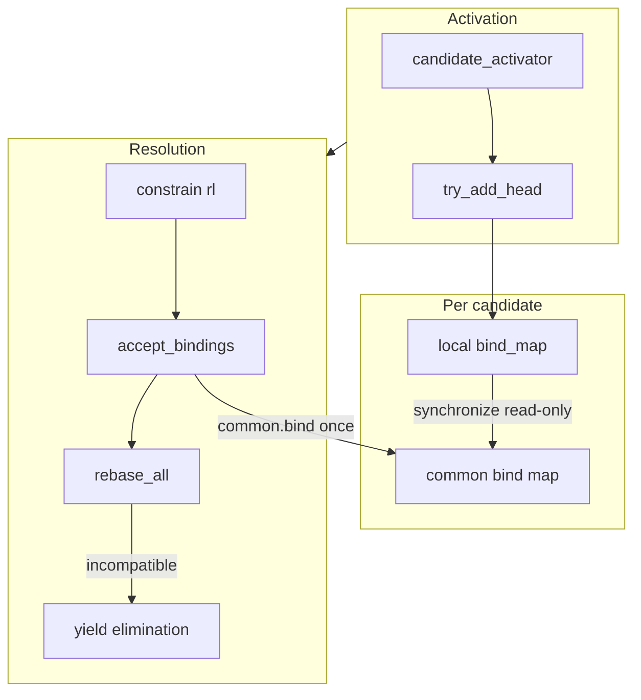

# MHU (Multi-Head Unification)

MHU is Atlas’s **prospective unification** layer. While a sim runs, many goal candidates may be active at once. Each candidate’s rule head must unify with its parent goal’s expression. MHU records those unifications **locally per candidate** and only **commits** bindings to the shared **common bind map** when a resolution is taken.

When one candidate’s bindings are committed, every other candidate’s local view is **rebased** against the new common state. If a head becomes inconsistent after rebase, that candidate is **eliminated** and yielded to the elimination pipeline.

Implementation: `mhu_elimination_generator` (`core/cpp/infrastructure/mhu_elimination_generator.cpp`).

Interfaces:

| Interface | Role |
|-----------|------|
| `i_try_add_mhu_head` | Register a candidate’s unify attempt (`try_add_head`) |
| `i_elimination_generator` | Commit a chosen resolution (`constrain`) and yield eliminations |
| `i_clear_mhu_heads` | Drop all MHU bookkeeping at sim teardown (`clear_mhu_heads`) |

Wiring: see [bootstrap.md](bootstrap.md). `sim` calls `joint_elimination_generator::constrain`, which runs **CDCL first, then MHU**. `candidate_activator` calls `try_add_head` when a candidate is activated.

Integration tests: `core/test/integration/mhu_elimination_generator.cpp`.

---

## Role in the solving loop

1. **Activation** — `candidate_activator` copies the rule head, fetches the goal expression, and calls `try_add_head(rl, goal, head)`. On failure the candidate is never linked into the goal’s candidate set.
2. **Resolution** — `sim` picks a `resolution_lineage*` (unit or decided) and calls `constrain(rl)`.
3. **Elimination routing** — MHU may `co_yield` other lineages whose heads became incompatible during rebase. `elimination_router` deactivates them.
4. **Resolve** — `resolver.resolve(rl)` deactivates sibling candidates on the same goal and expands the rule body.

MHU does **not** replace CDCL. CDCL eliminates candidates via learned avoidances; MHU eliminates candidates whose **heads** conflict under committed unifier bindings.

---

## Core data structures

### Common bind map

One shared `i_bind_map` (the **common** map) holds bindings committed during the sim. All candidates observe it through `whnf` during synchronization.

### Unify head (per candidate)

Each active candidate with a successful `try_add_head` owns a **`unify_head`**:

- **`local_bind_map`** — bindings produced by unifying the goal with the copied head (overlay state for that candidate only).
- **`unifier`** — runs unification against the local map.

MHU stores unify heads in `heads_`, keyed by `resolution_lineage*`.

### Link maps

Two indexes connect **common representatives (c-reps)** to the heads that depend on them:

| Map | Meaning |
|-----|---------|
| `rep_to_rls_` | rep index → set of lineages watching that rep |
| `rl_to_reps_` | lineage → set of rep indices it watches |

These are updated by `link` after successful sync and torn down by `unlink` / `remove_head`.

### Link-map invariant

For each active head `rl` in `heads_`, at all times **`rl_to_reps_[rl]`** (and the dual **`rep_to_rls_`**) satisfy:

**Only c-reps in common.** Every rep in `rl_to_reps_[rl]` is a c-rep in the common bind map: `common.whnf(make_var(rep)) == make_var(rep)` (pointer equality).

**All touched c-reps are watched.** Define the **touch closure** for `rl`: vars yielded by `unify(goal, head)` on that head’s local map, plus any vars pushed onto the synchronize work queue during nested `unify` calls in `synchronize`. For every rep in that closure that **still** is a c-rep in common at the current moment, `rep ∈ rl_to_reps_[rl]`. Indices that cease to be c-reps (because common published a binding for them) are **not** in the set.

**Progressive update.** When common changes via `accept_bindings`, `unlink(rep)` removes `rep` from every head’s watched set; successful `sync_and_link` on rebased heads **adds** newly discovered c-reps via `link`. Published reps are intentionally **not** relinked — they are no longer c-reps. `link` inserts into the set (union); removal happens only through `unlink(rep)` or `remove_head(rl)`.

In short: **`rl_to_reps_[rl]` is the set of touch-closure indices that are c-reps in common right now** — no more, no less.

---

## `try_add_head`

```text
try_add_head(rl, goal, head)
  → local bind_map + unifier
  → unify(goal, head) on local map
  → synchronize local state against common (read-only)
  → link c-reps for this rl
  → store unify_head in heads_
```

Steps in code:

1. Unify `goal` and `head` on a fresh local bind map. Collect **touched** variable indices from the unifier coroutine.
2. **`sync_and_link`** — walk touched vars, compare each rep’s local view with `common.whnf`, unify into the local map when common already binds that rep. Collect reps that are still **c-reps in common** (unbound there) and link them to `rl`.
3. Insert the unify head. **Caller must not** call `try_add_head` twice on the same `rl` (see [Caller preconditions](#caller-preconditions)).

Synchronization is **lookahead**: incompatible candidates fail before anything is committed to common. That is why MHU can be cleared cheaply at sim start — no common bindings exist yet at activation time in a fresh sim frame.

---

## `constrain`

Called when the solver **commits** to resolution `rl`:

```text
constrain(rl)
  → remove sibling unify heads on the same goal (no yield)
  → unlink(rl) → c_reps this head was watching
  → accept_bindings(local map, c_reps) → publish to common, rebase others
  → erase rl from heads_
  → yield eliminated lineages from rebase failures
```

### Sibling head removal

For every other candidate rule on the same goal lineage, MHU calls `remove_head` on that sibling’s lineage. These removals are **not** yielded as eliminations — the chosen rule subsumes its siblings for MHU bookkeeping. Full candidate deactivation still happens later in `resolver.resolve`, which deactivates all candidates on the parent goal.

### Publishing bindings (`accept_bindings`)

For each rep in `c_reps`:

1. Read `whnf = local_bind_map.whnf(rep)` using the canonical var from `i_make_var`.
2. If `rep == whnf` (pointer equality), the rep is still a **local c-rep** with nothing new to publish — **skip**.
3. Otherwise `common.bind(rep, whnf)` and run **`rebase_all(rep)`** on every other head that was linked to that rep.

Eliminations produced during `rebase_all` are forwarded to the `constrain` caller.

---

## Common bind map invariants

These invariants are assumed throughout MHU. They match `bind_map` behavior (`core/cpp/infrastructure/bind_map.cpp`).

### Bind once per index

`bind_map::bind` **inserts only** — it never updates an existing binding. A variable index in common is bound **at most once** for the lifetime of that sim frame.

There is no “change rep” or “rebind” operation on an index that already has a binding. Later unifications refer to existing values through **`whnf`**, which follows the bind chain (with path compression) to the current representative.

Because of bind-once semantics, `accept_bindings` does not need a separate “already bound in common?” check before `common.bind`: any rep in `c_reps` at publish time is one that **still has no binding in common**. Reps that were already published were unlinked from watching heads during earlier `rebase_all` passes (see below).

### Younger-to-older binding

When the bound value is itself a variable, `bind_map` requires the bound index to be **older** (lower index) than the binder. The unifier enforces the same convention locally. Publishing therefore typically binds **younger** reps to older reps or ground terms; older reps whose local `whnf` is still the bare rep are skipped in `accept_bindings`.

---

## C-reps (common representatives)

A **c-rep** is a variable index that is **unbound in the common map** — its `common.whnf(var_i)` is the canonical var expression itself (pointer equality with `make_var(i)`).

During **`synchronize`**, for each touched rep:

- If `var_expr == common.whnf(var_expr)`, the rep is still a c-rep in common → record it for linking.
- Otherwise unify the local rep with common’s value on the **local** map.

C-reps are what the link maps track. Only heads that watch a rep **while it remains a c-rep in common** need invalidation when that rep is eventually published.

### Pointer equality for “still a c-rep?”

The test `rep_expr == whnf` uses **pointer identity**, not structural equality. That is intentional: for an unbound rep, `whnf` returns the same interned var pointer from `expr_pool` / `i_make_var`. The question being asked is “is this index still a representative in common?” not “does this expression structurally match?”

---

## Rebase and elimination

### `rebase_all(rep)`

When common publishes a binding for `rep`:

1. **`unlink(rep)`** — detach `rep` from every lineage that was watching it.
2. For each affected lineage, **`sync_and_link`** — seed the work queue with `rep`, run `synchronize` against the updated common map, relink any reps that are **still** c-reps in common.
3. If synchronization fails, the head is incompatible → **`remove_head`** and **yield** that lineage.

### Rep left unlinked after successful rebase

After a successful rebase, the published rep is **deliberately not relinked** to heads that were just synchronized:

```text
// NOTE: leave the previously changed rep unlinked from the heads
// since it is now up-to-date w.r.t. the common bind map
```

The head’s local overlay was updated during sync; common already contains the binding for that index. There is no further invalidation hook on that index — **which is safe because common never rebinds that index**. If other indices change later, rebases run only for heads still linked to those indices, or through unify’s `whnf` traversal from a seed rep that is still tracked.

This is **not** a stale-binding hazard: unification always compares against **`common.whnf`**, and local state is refreshed on each rebase. An index that dropped off the link map is one whose binding in common is final for the rest of the sim.

### Eliminations are not rollbacks

When `rebase_all` eliminates heads, **common bindings already published in the same or earlier `accept_bindings` steps are not rolled back**. Elimination means “this candidate can no longer be chosen,” not “the sim is in conflict.” That matches how `sim` treats MHU yields alongside CDCL: incompatible heads are removed from search without undoing prior commitments.

---

## `clear_mhu_heads`

At sim teardown, `clear_mhu_heads` clears `heads_`, `rep_to_rls_`, and `rl_to_reps_`.

It does **not** clear the common bind map. Common bindings belong to the sim frame and are undone by **`pop_trail_frame`** / `clear_bindings` in the broader teardown sequence (see [cdcl.md](cdcl.md), [restart.md](restart.md)).

After a partial constrain, clearing MHU heads resets bookkeeping only — common still reflects committed bindings, and new `try_add_head` calls must synchronize against that state.

---

## Caller preconditions

MHU relies on callers to maintain these contracts:

| Precondition | Why |
|--------------|-----|
| **At most one `try_add_head` per `resolution_lineage*`** | Duplicate insert is a debug assert; production assumes the activator never retries on the same lineage without teardown. |
| **`constrain(rl)` only after successful `try_add_head(rl, …)`** | `constrain` uses `heads_.at(rl)`; missing heads are a caller bug. |
| **Goal/head expressions from stable pools in production** | `candidate_activator` uses copied heads and stored goal exprs. Bindings published to common hold `const expr*`; interned pool pointers remain valid for the sim. |

Violations are not handled gracefully inside MHU — they indicate incorrect orchestration in `sim` / activation, not recoverable runtime conditions.

---

## Interaction with CDCL and joint elimination

| Component | When it runs | Effect |
|-----------|--------------|--------|
| `cdcl_elimination_generator` | First in `joint.constrain` | Narrows avoidances; may yield eliminations |
| `mhu_elimination_generator` | Second in `joint.constrain` | Publishes unifier bindings; may yield head-conflict eliminations |

Order is intentional: CDCL work is cheaper; MHU may run unification-heavy rebase work.

The solver learns lemmas through **CDCL** (`i_learn_avoidance`), not MHU. MHU only maintains consistency of concurrent unify attempts under the common bind map.

---

## Mental model (summary)



In one sentence: **MHU keeps parallel unify attempts consistent with a monotonically growing common substitution; choosing one candidate commits its bindings and eliminates any other whose head can no longer unify.**

---

## Related reading

- [bootstrap.md](bootstrap.md) — manifest wiring for MHU, joint, and activator
- [cdcl.md](cdcl.md) — trail frames and avoidances (complementary elimination path)
- [elimination.md](elimination.md) — elimination routing and backlog
- [testing.md](testing.md) — integration vs unit tests for MHU
